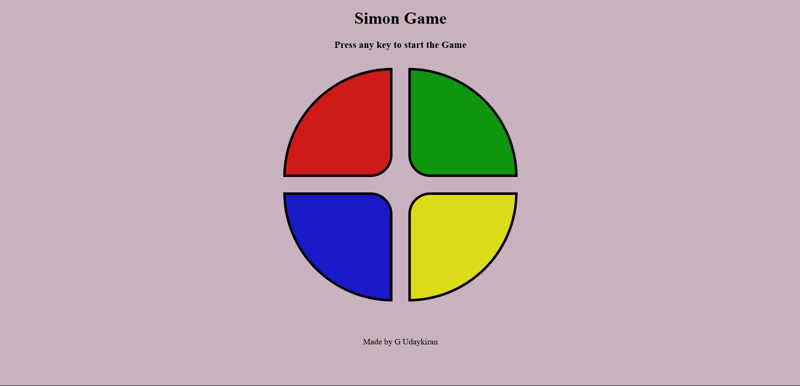

**Simon Game**

A classic Simon Game implemented using HTML, CSS, and JavaScript. The game challenges players to repeat a sequence of colors that grows longer with each level. The project includes sound effects and visual feedback to enhance the gaming experience.

**Features**
- Interactive gameplay with four colored buttons (red, blue, green, yellow).
- Randomly generated sequences that increase in length with each level.
- Visual and audio feedback for button presses and game events.
- Game over screen with score display and option to restart.
- Responsive design for a clean and centered layout.

**Screenshots**

**How to Play**
1. Press any key to start the game.
2. Watch and listen as the game flashes a sequence of colored buttons.
3. Click the buttons in the same order as the sequence.
4. If you repeat the sequence correctly, the game advances to the next level with a longer sequence.
5. If you make a mistake, the game ends, displaying your score (level reached).
6. Press any key to restart after a game over.

**Installation**
1. Clone the repository:
   git clone https://github.com/Udaykiran3104/Simon-Game.git
2. Navigate to the project directory:
   Open index.html in a web browser to play the game.
   
**Technologies Used**
1. HTML: For structuring the game interface.
2. CSS: For styling the buttons, layout, and visual effects like flashes and clicks.
3. JavaScript: For game logic, event handling, and sequence generation.
4. Audio Files: For sound effects to enhance user experience.
